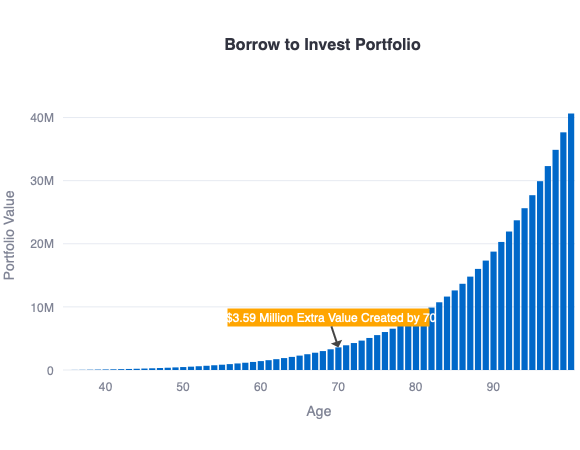

# Borrow to Invest Visualizer

This app helps homeowners to understand the value of borrowing to invest. By using the equity in your house, you can take out a loan and invest it in the stock market or other assets that generate higher returns than the interest rate. This way, you can build wealth over time and achieve your financial goals faster.

**Demo**

You can try out the web application here: : - https://borrow-to-invest.streamlit.app




By borrowing against your house at age 35 and investing the money at a 10% annual return, you can accumulate an **extra $3.59 million** by age 70, assuming your house appreciates by 5% per year.


## Local Setup

The app is built with Streamlit, a Python framework that simplifies AI app development. You can run the app locally

```bash
streamlit run borrow-to-invest.py
```


## Contributing
If you want to contribute to this project, you are welcome to do so. You can fork this repository, make your changes, and submit a pull request. You can also open an issue if you find any bugs or have any suggestions for improvement.

If you find this app useful, please give it a star or share it with others. If you have any feedback, questions, or suggestions, please open an issue or a pull request or submit here https://forms.office.com/r/NbWbtQwL7W. Thank you for your interest and support! 😊

